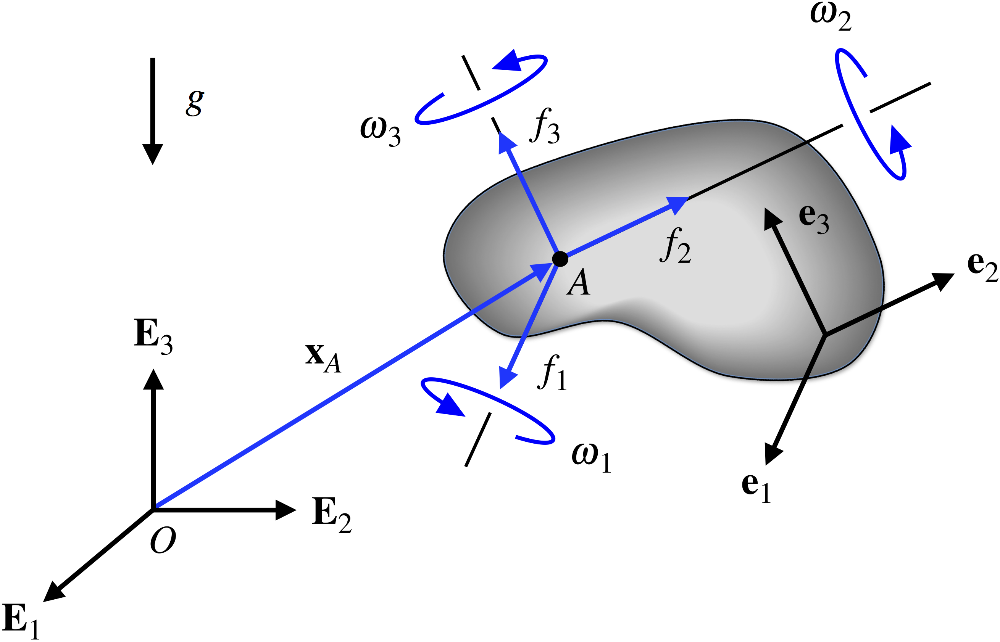
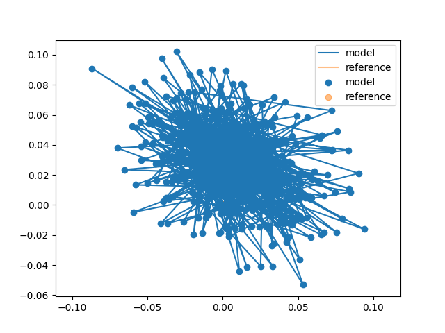

# Innovation Filtering

Author: Buck Baskin [@buck@fosstodon.org](https://fosstodon.org/@buck)
Created: 2023-09-19
Updated: 2023-10-29
Parent Design: [designs/python_ui_demo.md](../designs/python_ui_demo.md)

## Overview

FormaK aims to combine symbolic modeling for fast, efficient system modelling
with code generation to create performant code that is easy to use.

The Five Key Elements the library provides to achieve this user experience are:
1. Python Interface to define models
2. Python implementation of the model and supporting tooling
3. Integration to scikit-learn to leverage the model selection and parameter tuning functions
4. C++ and Python to C++ interoperability for performance
5. C++ interfaces to support a variety of model uses

This design focuses on an example of the "Python Interface to define models" to
define a reference model for a strapdown IMU. This serves two purposes:
1. Provide a reference for implementing a strapdown IMU as a part of other models
2. Further exercise the FormaK interface to sand down rough edges

As a third consideration, this will also provide a reference design for how
other reference models will be designed and presented in the future.

## Solution Approach

### The Strapdown IMU

What is a strapdown IMU?

A strapdown IMU is an IMU mounted to the vehicle of interest (instead of being
mounted on a gimbal or on some reference point).

### Definitions

This design will implement the strapdown IMU model defined by the source
[Strapdown inertial navigation | Rotations](https://rotations.berkeley.edu/strapdown-inertial-navigation/).
The site is a joint resource from the mechanical engineering departments at
Rose-Hulman Institute of Technology and UC Berkeley.

- [Source](https://rotations.berkeley.edu/wp-content/uploads/2017/10/tracked-body.png)

- $e_{i}$ axis of rigid body (1, 2, 3)
- $\omega$ vector of rotations of the rigid body
- $\omega_{i}(t) = \omega \cdot e_{i}$ IMU reading of rotation
- $g$ acceleration due to gravity
- $\ddot{x_{A}}$ acceleration of the rigid body at the IMU measurement point A
- $f_{i}(t) = (\ddot{x_{A}} - g) \cdot e_{i}$ IMU reading of acceleration (specific force)

The reference design uses 3-2-1 Euler angles.

- [Source](https://rotations.berkeley.edu/wp-content/ql-cache/quicklatex.com-5bc0ef31513d8f6aa027b50b28f7dba9_l3.svg)

- [Source](https://rotations.berkeley.edu/wp-content/ql-cache/quicklatex.com-7dc4cf09b3717d6ebc1d7ca32a1e3dda_l3.svg)

With the accelerations defined, we can then integrate the acceleration once into velocity and then twice into position.

$$v_{t + 1} = v_{t} + dt * a_{t}$$

$$x_{t + 1} = x_{t}_{} + dt * x_{t} + \dfrac{1}{2} dt^{2} * a_{t}$$

## Feature Tests

The "Rotations" resource also provides an implementation of the strapdown IMU
model for tracking a
[tumbling smartphone](https://rotations.berkeley.edu/reconstructing-the-motion-of-a-tossed-iphone/).

The feature test will implement the strapdown model based on the data provided
and revisions to the reference model suggested in the resource.

## Roadmap and Process

1. Write a design
2. Write a feature test(s)
3A. Experiments
3B. Build a simple prototype
4. Pass feature tests
5. Refactor/cleanup
6. Build an instructive prototype (e.g. something that looks like the project vision but doesn't need to be the full thing)
7. Add unit testing, etc
8. Refactor/cleanup
9. Write up successes, retro of what changed (so I can check for this in future designs)

## Post Review

### 2023-10-29

This design has grown in time further than I would have liked. Originally, I'd
aimed for 2 weeks to 4 weeks, and it's now closer to 6.

A few things have stayed the same. The design remains intended to provide a
reference for inclusion in other designs and I was able to learn from some of
FormaK's rough edges. Unfortunately, one aspect (simplify execution time)
cropped up again and I did not reach a suitable resolution.

The few things that have stayed the same are notable because pretty much every
aspect of this design has been adapted from the original.

#### Sympy, Quaternions

The math outlined above was largely replaced by using the Sympy Quaternion
model. This was absolutely the correct decision and I should have done some
more research before starting to see if Sympy had this type of rotation
representation already. At latest, this should have been found in the
experimental phase of the project. In the end, ~3 weeks could have been cut out
of the timeline if I'd recognized this at the experimental phase.

#### Feature Testing

The feature test was also replaced wholesale. This was partly for convenience
(I already have NASA data) but also because the NASA data comes with clearly
defined motion information. The start of the data is pre-ignition and then
there are also known times for ignition and liftoff. This pre-ignition data
serves as a more test-able feature test because I can know the orientation of
the IMU (provided by the NASA documentation) and perform a pseudo-static test
to assert that the motion of the sensor data doesn't move. This pseudo-static
test made it easy to understand when the model wasn't oriented correctly or
incorrectly accommodating gravity. For example, something is off when there's a
2g (19.62 m/s2) effect in what should be a static test.

The change in feature test also provided the motion for two extensions to the
model beyond the basics: calibration for IMU orientation and calibration for
IMU acceleration biases.

First, the IMU was rotated in all axis away from the nominal navigation frame,
motivating the use of calibration to "remove" this in favor of reporting in
neat and tidy vehicle aligned axis.

Second, the IMU exhibited acceleration bias that quickly caused non-zero motion
even over relatively short time scales (~1 second). Some of the bias could be
corrected, but some was also a random walk that would need to be modeled within
the noise in a full filter implementation and corrected for via fusion with the
onboard LIDAR system.

#### Unit Testing

The design also missed some straightforward opportunities for unit testing.
Specifically, the final implementation has unit tests for static motion and
circular motion that have straightforward closed-form references to compare to
the IMU model.
